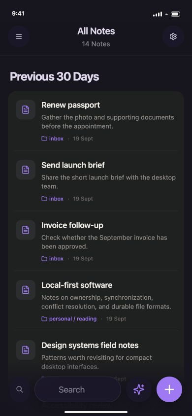
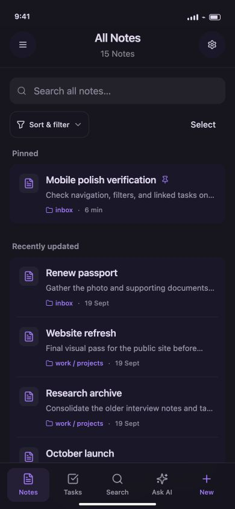
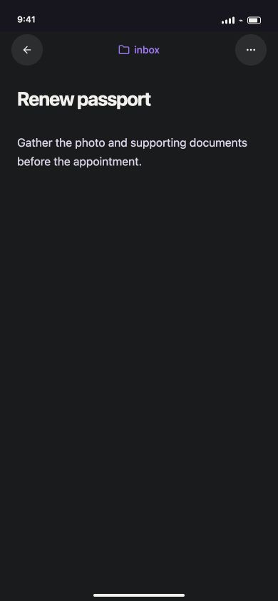
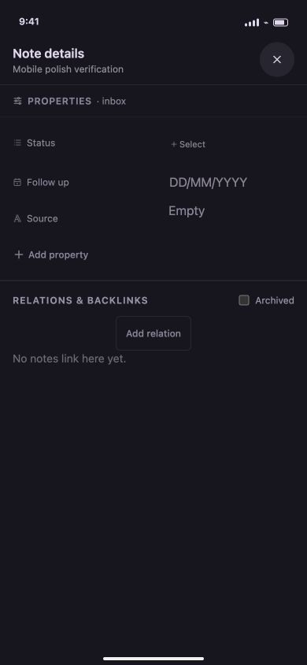
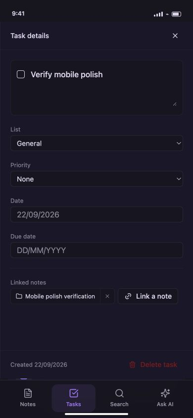
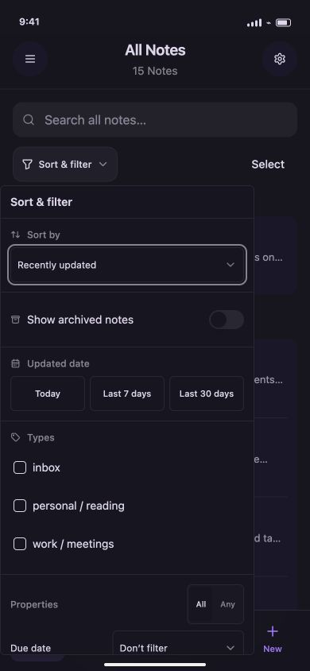
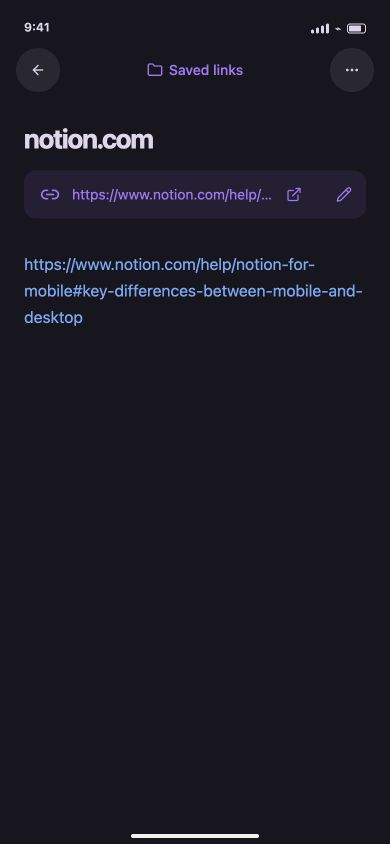
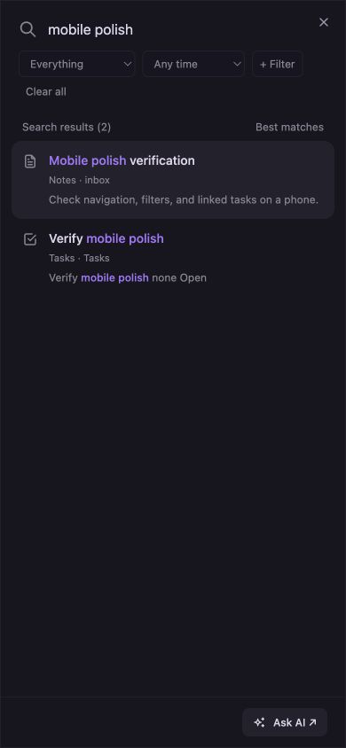
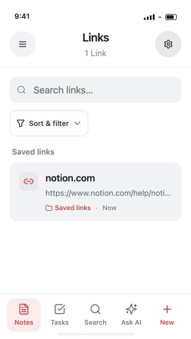

# Mobile experience review — 22 September 2026

This review covers the mobile web workspace and its shared iOS UI. It combines
current-run browser captures, interaction checks, and a desktop/mobile code
comparison. Screenshots use the browser's local preview vault, including a
verification note, task, and reference link created during this review.

## Reference and approach

[Notion's mobile guidance](https://www.notion.com/help/notion-for-mobile) informed
single-column layouts and visible touch actions. This is a review of Zerus, not
a hands-on audit or visual clone of Notion's native app. Keep Zerus's theme and
plain-file model while making navigation and organization easier with a thumb.

## Findings and implemented changes

1. **Library and navigation — improved, verified.** The old bottom bar split
   attention between two search controls and unlabeled icons. The heading
   “Previous 30 Days” did not apply a date filter. The library now uses a labeled
   Notes / Tasks / Search / Ask AI / New bar, separate collection search, compact
   rows, readable pinned indicators, and truthful sort labels. Desktop chrome
   no longer squeezes into the browser `/app` route below 768px. Native mobile
   fills the available screen; the simulated phone frame is for larger browser
   previews. The drawer includes Tasks, Links, Files, external notes, types,
   and Recently Deleted.

   Before:

   

   After:

   

2. **Note creation and editing — working in the browser; native keyboard pending.**
   Created and saved a note using the shared Markdown editor. Existing
   properties, relations, history, export, attachment and note actions remain
   available. Background library controls are inert while another workspace
   surface covers them. Gesture-driven navigation/action/property sheets now
   contain keyboard focus and support Escape. Note header and sheet colors
   follow the selected theme. No physical keyboard/IME or touch-gesture
   performance claim is made from browser testing.

   The original note surface was already focused and readable:

   

   The updated details panel adds note context and larger property controls;
   opening it and dismissing it with Escape were verified.

   

3. **Tasks and linked-note navigation — improved, verified.** Tasks are now a
   first-class destination instead of only appearing after selecting a search
   result. The desktop task workspace supplies lists, dates, priorities, views,
   search, sorting and linked notes. Narrow screens put search and sorting on
   their own row. Created a task, linked the verification note, opened it, and
   returned to the same task details. Browser history retains the originating
   task and the note's Back control describes its destination.

   

4. **Filtering and bulk organization — added, verified.** Mobile now reuses
   desktop sorting, updated-date, archive, type, file-extension and all/any
   property filters. Filter options come from the current collection. Choosing
   Today reduced the test library to the newly created note. Select mode exposes
   the existing bulk pin/unpin, archive/unarchive, property editing, preview,
   and action-history workflow. Selected and pinned the verification note using
   a bulk-action preview. Existing bulk tests exercise mutation and recovery;
   every bulk action was not individually repeated in the browser. Filter
   controls and selection actions use larger touch targets. Property visibility
   buttons are hidden when no visibility handler is provided.

   

5. **Saved links — added, verified.** The drawer now exposes the saved-link
   collection. Created a web link, rejected an invalid URL edit, then saved a
   valid replacement address. The note has visible Open and Edit controls and
   shows “Saved links” instead of its internal storage path. Shared store logic
   preserves the title and notes and rejects duplicate destinations. Live
   embedded web previews remain a desktop capability.

   

6. **Global search — accessible and verified.** The persistent Search destination
   opens the existing full-screen search. The verification query finds both its
   note and task. Collection and date filters and Ask AI remain available.
   Local collection search uses deferred rendering to keep input responsive.
   This is not a large-vault latency benchmark.

   

7. **Small screens and themes — visually checked.** Checked the 390×844 layout
   in dark mode and 320×568 in light mode. The primary controls stay in view;
   list text and cards use theme colors. Restored the original dark appearance
   after testing. Inputs use a 16px minimum in the mobile shell to avoid iOS
   focus zoom. These checks do not establish WCAG compliance or VoiceOver
   correctness; those require device and assistive-technology testing.

   

## Desktop/mobile feature comparison

| Area | Mobile status after this change |
| --- | --- |
| Markdown, note properties, relations/backlinks | Existing shared functionality retained |
| Global search and AI entry | Direct labeled navigation; existing providers/chat retained |
| Tasks and task lists | Shared desktop workspace now directly accessible |
| Sort/date/type/property filters | Shared desktop logic and controls |
| Bulk pin/archive/property updates | Shared previews, execution and action history |
| Saved links | Create, read, open, edit URL and notes |
| Note history, export, attachments, trash | Existing mobile actions retained; native platform operations not exercised here |
| Board/table/gallery/calendar and named view presets | Still desktop-only layouts; require a dedicated mobile adaptation |
| Multi-tab desktop workspace, CLI, local file-manager integration | Platform-specific; no mobile equivalent added |
| Embedded web/PDF/document previews | No new native preview engine in this change |

## Validation and remaining checks

- `pnpm test`: 88 files, 600 tests passed, including task-origin history regression coverage.
- `pnpm typecheck` and `pnpm lint`: passed.
- `pnpm build`: passed, including frontend chunk-graph verification. Vite still
  reports large chunks in the existing application graph; this change does not
  establish a cold-start performance budget.
- Browser checks: note creation; selection and bulk pin; task creation and
  linked-note return; saved-link creation, URL validation and update; global
  search; Today filter; 320px/light and 390px/dark layouts. No runtime errors or
  warnings were captured during the checked flows.
- `/app` responded with HTTP 200 from the frontend server and private Tailscale
  Serve endpoint. No Funnel/public exposure was enabled.
- Pending native checks: physical iPhone keyboard/caret behavior, interactive
  swipes, safe areas under rotation, VoiceOver/Dynamic Type, large cloud vaults,
  background/foreground restoration, Files/Drive permissions, native export,
  and launch/memory behavior. No iOS archive, upload, or release was produced.

Preview: https://mac-mini-m4-nox.ibex-oratrice.ts.net/app
